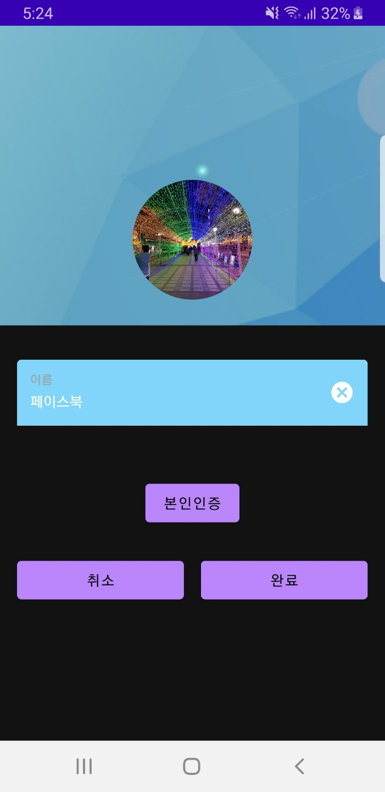
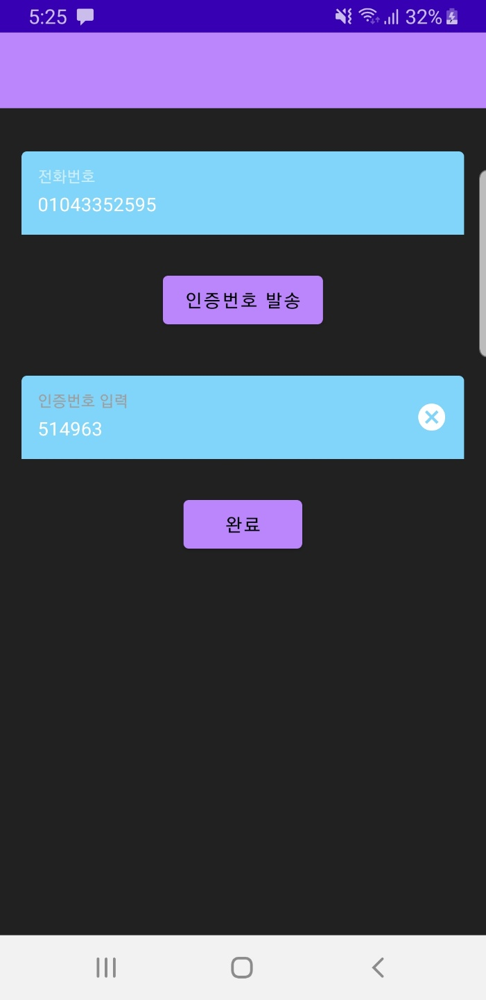
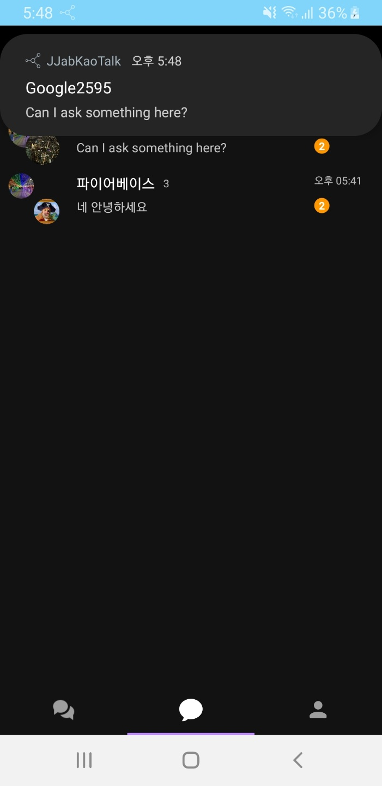
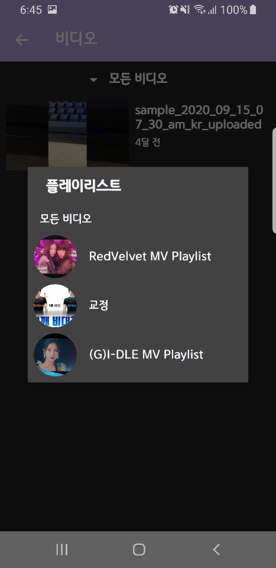

# 김성주 SEONGJU KIM

## Education
동아대학교 전자공학과 졸업 (2013.03 ~ 2019.02) 
성도고등학교 졸업 (2010.02 ~ 2012.12)

## Android Applications
### 짭카오톡
#### Description
카카오톡과 유사한 SMS 애플리케이션입니다.

#### Features
소셜 로그인
* Firebase에서 직접적으로 API를 지원하는 페이스북과 구글 로그인을 구현했습니다.
* Firebase의 Functions을 이용하여 Firebase API에서 직접적으로 지원하지 않는 네이버와 카카오 로그인을 구현했습니다.  
</img>
</img>
</img>  

프로필 생성, 친구 추가
채팅방 생성, 채팅, 채팅방 나가기
* Firestore Query를 사용하여 지역별 오픈 채팅방을 구현했습니다.
* Firebase Firestore를 사용하여 채팅, 프로필 생성, 친구 추가 기능을 구현했습니다.
* 카카오톡의 읽음, 읽지 않은 메시지 카운트를 구현했습니다.  
</img>
</img>
</img>
</img>  

본인인증
* Firebase Phone Auth를 사용하여 유저의 기기로 인증번호를 발송하고 입력하도록 하여 본인인증을 구현했습니다.  
</img>  

클라우드 메시징
* Firebase Cloud Messaging을 통해 채팅 메시지를 상대방의 기기로 전송합니다.
* Notification 클릭 시 채팅방으로 이동합니다. 
</img>  

### Play Store
https://play.google.com/store/apps/details?id=com.grand.duke.elliot.jjabkaotalk

### 포토 다이어리
### Description
사진, 동영상, 오디오 및 현재 위치 등을 함께 기록할 수 있는 다기능 다이어리 애플리케이션입니다.

#### Features
* 지도 정보를 다이어리에 저장할 수 있습니다.
* 구글맵 API를 사용하여 현재 위치 정보를 가져올 수 있습니다.

#### 다양한 미디어 등록을 지원합니다.
* 사진, 동영상 및 음성 파일을 지원합니다.
* 오픈소스 라이브러리를 이용한 그림 그리기 및 사진 편집 기능을 지원합니다.

폴더와 해시태그 및 날씨를 지정할 수 있습니다.

#### 공유
문자, 이메일 및 카카오톡으로 작성한 노트를 공유할 수 있습니다.
페이스북 API를 사용하여 페이스북 게시글로 export 할 수 있습니다.

노트별로 텍스트 테마를 지정할 수 있습니다.
무료 폰트와 색상, 정렬 및 스타일을 지원합니다.

데이터 백업을 지원합니다.
* 등록된 계정의 구글 드라이브에 데이터를 백업할 수 있습니다.
* 디바이스 저장소에 데이터를 백업할 수 있습니다.

잠금 화면을 지원합니다.
* 보안을 위해 잠금 화면을 설정할 수 있습니다.
* 지문 인식 기능을 지원합니다.
* 비밀번호 찾기 기능을 지원합니다.

테마 지원
* 폰트, 색상 및 야간 모드 테마를 지원합니다.

캘린더
오픈소스 라이브러리를 이용한 캘린더를 지원합니다.
특정일에 다이어리를 작성할 수 있고, 기념일을 등록할 수 있습니다.

알림
일일 알림을 설정할 수 있습니다.

### 비디오 다이어리
유튜브 비디오를 다이어리에 등록하고 그에 따른 내용을 작성할 수 있는 애플리케이션입니다.
### Features
1. 유튜브 비디오 가져오기 
구글 계정을 통하여 OAuth2 인증 토큰을 유튜브 데이터 API로 요청합니다. 
보안 문제로 WebView에서 인증을 진행할 수 없어 CustomTabView를 사용합니다.  
</img>
</img>
</img>  
수신한 토큰을 사용하여 유튜브 Access code를 요청합니다.   
</img> 
수신한 Access code와 함께 YouTube Data API로 채널 정보를 요청하면 해당 계정의 유튜브 계정(브랜드 계정 포함)을 수신합니다. 
채널 정보를 수신했으니 플레이리스트 및 자신이 등록한 비디오에 접근할 수 있습니다.

2. 로컬 데이터 베이스
작성된 다이어리를 로컬 데이터 베이스에 저장합니다.  
Room Database를 사용합니다.  
YouTube Data API의 할당량을 조절하기 위해서도 사용합니다.
만약 매 애플리케이션 실행마다 유저의 유튜브 계정에 접근하여 비디오 데이터를 가져온다면, API 할당량이 많이 부족할 것입니다.
그를 조절하기 위해서 마지막으로 업데이트한 시간 기준으로 3시간이 경과한 뒤에만 API를 요청합니다. 
3시간 이내에 애플리케이션을 실행한다면 로컬 데이터 베이스에서 비디오 데이터를 가져옵니다.

3. UI 및 테마
* 다크 모드를 지원합니다.
* 테마 색상을 적용할 수 있습니다.
* 오픈소스 라이브러리를 통한 UI를 구현합니다.
Observable ScrollView

4. Firebase
채널 정보는 Firebase Firestore를 통해 관리됩니다.</b>
위의 로컬 데이터베이스로 관리되는 대상은 비디오 및 플레이리스트입니다.
* 버전 관리
파이어베이스의 remote config를 사용하여 버전 업데이트를 유저들에게 알립니다.

5. Play Store
[비디오 다이어리]:https://play.google.com/store/apps/details?id=com.duke.elliot.youtubediary

## Papers
1. 3축 가속도 센서를 이용한 낙상 인지 및 사후처리 시스템 
https://www.dbpia.co.kr/journal/articleDetail?nodeId=NODE07614256&language=ko_KR&language=ko_KR# 

2. 자폐스펙트럼장애 영유아의 음성 특징에 관한 연구
https://github.com/peter4549/Resume/blob/main/papers/%EC%9E%90%ED%8F%90%EC%8A%A4%ED%8E%99%ED%8A%B8%EB%9F%BC%EC%9E%A5%EC%95%A0%20%EC%98%81%EC%9C%A0%EC%95%84%EC%9D%98%20%EC%9D%8C%EC%84%B1%20%ED%8A%B9%EC%A7%95%EC%97%90%20%EA%B4%80%ED%95%9C%20%EC%97%B0%EA%B5%AC.pdf

